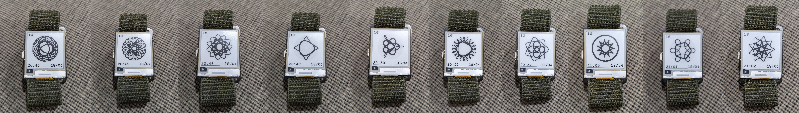

# Spirographs on your Watchy



A spirograph watch face for your [Watchy](https://watchy.sqfmi.com/). A random spirograph on your wrist every minute.

## Build

Build using https://platformio.org/ or use Arduino IDE.

```
$ pio run -t upload
```

To check out the parameters used to draw each spirograph, ensure you watch is connected over USB and run.
```
$ pio device monitor
```